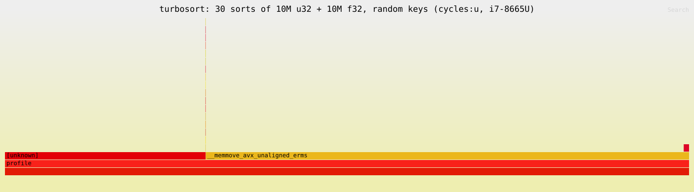

# Profiling turbosort

This page shows where the radix path spends its cycles and cache misses. It was
measured with Linux `perf` on the same Intel i7-8665U laptop as the
[benchmarks](../README.md#benchmarks) (4 cores, 8 threads, AVX2, 8 MB L3
cache, 15 W). The author recorded these numbers for the 0.2.1 release. The sort
code has not changed since 0.2.0, and the numbers have not been re-run since.

## Reproduce

`examples/profile.rs` is the workload. With no arguments it sorts 10M random
`u32` and 10M random `f32`, thirty times each. Before every sort it clones an
unsorted master buffer, so the sort never sees its own output. The per-type
wrappers are `#[inline(never)]`, so each shows up as its own tower in a
flamegraph.

Build it with frame pointers. Dwarf unwinding loses the AVX2 hot loops under
`perf script`, so `--call-graph fp` is the recipe that works. The last step
needs [inferno](https://crates.io/crates/inferno) (`cargo install inferno`).

```sh
RUSTFLAGS="-C force-frame-pointers=yes" cargo build --profile profiling --example profile
perf record --call-graph fp -F 997 -e cycles:u -- target/profiling/examples/profile
perf script --inline | inferno-collapse-perf | inferno-flamegraph > docs/flamegraph.svg
```

The `profiling` build profile in `Cargo.toml` is the release profile with debug
info. Arguments narrow the workload for `perf stat` sweeps:

```sh
profile [TYPE] [N] [ITERS] [ALGO]
#  TYPE   u32 | f32 | all      (default all)
#  N      element count        (default 10000000)
#  ITERS  sorts per type       (default 30)
#  ALGO   ts | std             (default ts; std = sort_unstable baseline)
```

Timing starts after the clone, so the printed time covers only the sort.

## Where the cycles go

[](flamegraph.svg)

On the default workload, the scatter passes take 73% of cycles and the
histogram scans take 22%. The rest is the harness's per-iteration clone (3%)
and startup. The sorted-input check does not register: on random data it stops
within the first few elements.

## Cache behaviour

This table comes from a `perf stat` sweep of `examples/profile` on random `u32`.
Each time is the mean of 30, 10 and 3 back-to-back sorts at 1M, 10M and 100M
keys, so the times differ slightly from the criterion tables in the README. The
ratios agree. The counters cover the whole process, including data generation
and the per-iteration clone, the same way for both sorts. Per-key counters do
not depend on clock speed, which makes them the stable metric on a 15 W chip.
LLC is the last-level cache (the L3 here) and IPC is instructions per cycle.

| Random `u32`               | 1M      | 10M    | 100M   |
| -------------------------- | ------- | ------ | ------ |
| turbosort                  | 5.6 ms  | 84 ms  | 0.80 s |
| `std::sort_unstable`       | 15.7 ms | 188 ms | 2.53 s |
| speedup                    | 2.8x    | 2.2x   | 3.2x   |
| turbosort LLC misses/key   | 0.32    | 0.95   | 0.99   |
| turbosort instructions/key | 53      | 55     | 61     |
| `std` instructions/key     | 180     | 210    | 245    |
| turbosort IPC              | 2.1     | 1.9    | 1.9    |
| `std` IPC                  | 2.9     | 2.8    | 2.8    |

The table shows two regimes. At 1M keys the 8 MB working set (data plus
scratch) half fits in the chip's 8 MB L3, so only about a third of keys miss.
From 10M keys up, every key costs one LLC miss, and the sort runs against main
memory with IPC near 1.9.

`std`'s `sort_unstable` behaves the other way round. It is compute-bound at IPC
2.8, and its instructions per key grow with log n (180 to 245 from 1M to 100M).
The radix sort stays near 55 instructions per key. That is why the gap widens
to about 3x at 100M keys. Running the pair in the opposite order gives 2.97x,
so the gap is not a thermal effect. The ratio is highest at the largest size
tested, so there is no drop-off at large sizes.

Recording cache misses instead of cycles (`perf record -e cache-misses:u`, 100M
keys) puts 88% of the sort's LLC misses in the scatter pass. The histogram
scans and the copy-back are sequential streams that the hardware prefetcher
covers. dTLB misses (misses in the cache of page-table entries for data) stay
under 0.007 per key at every size with plain 4 KB pages. The scatter writes 256
destination streams, each one sequential, so the set of hot pages stays near
256 however large the array grows.
